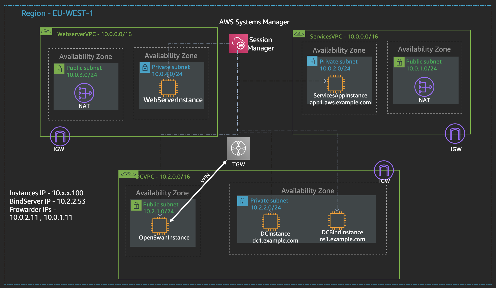

The cloudformation template sets up intial VPCs and instances as depicted below.

It is recommend to run the CF template in a new account as it creates 3 VPCs and 4 EIPs in `eu-west-1`. 


_**Note: Please delete the default VPC to remove the clutter**_



## Set up the VPN with DC VPC

1. Ensure that VPN status in your AWS environment is in 'available' state before setting up the VPN on the openswan instance.

2. Capture the VPN endpoint IP and secret key from your AWS environment. We will only set up one tunnel due to limitations with OpenSwan routing capabilities. 

3. Open a session to your OpenSwan instance using sessions manager and run the following commands.

```bash
cd / 
sudo ./connection-setup.sh <VPN-Endpoint-IP> <secret>

# example: sudo ./connection-setup.sh 1.1.1.1 Amazon123
```

4. Verify ipsec service and tunnel status.

```bash
sudo ipsec verify
sudo ipsec status
```

5. Verify ip xfrm policies ( you should have an In, Out and Fwd rule)

```bash
sudo ip xfrm policy
```
